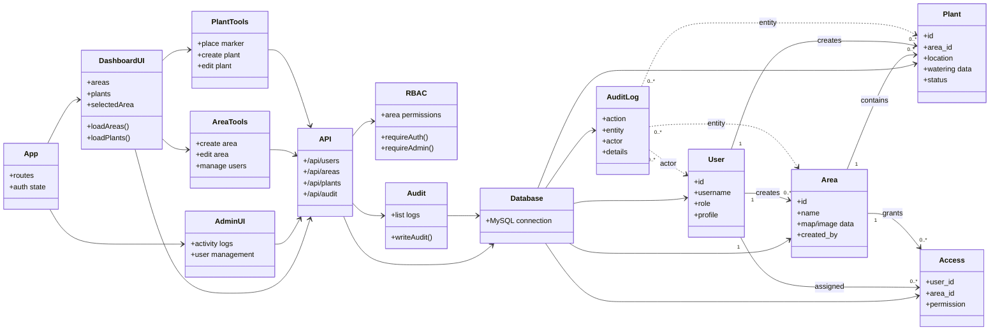
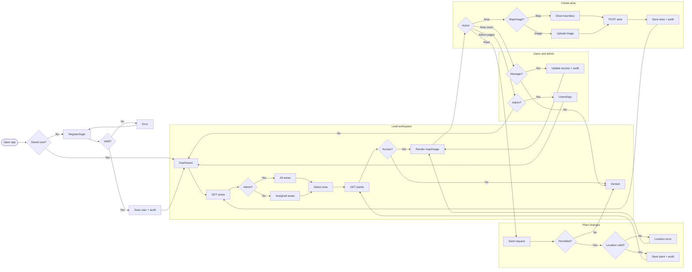

# Watering Dashboard Diagrams

These diagrams describe the implemented structure and main runtime flow of the
Watering Dashboard application.

Note: the database migrations include `area_manager` as a global role, but the
current backend RBAC helper recognizes only `user` and `admin` as global roles.
Area-level permissions still include `read`, `update`, `area_manager`, and
`admin`. Because of that, some UI flows allow area-level editors while the
current backend `canManageAreas()` check only allows global admins.

## Class Diagram

## Activity Diagram

